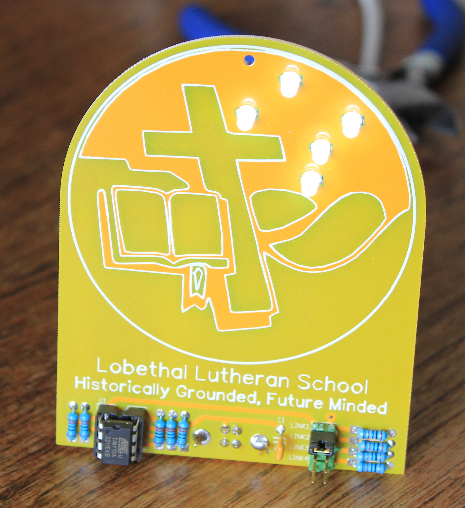
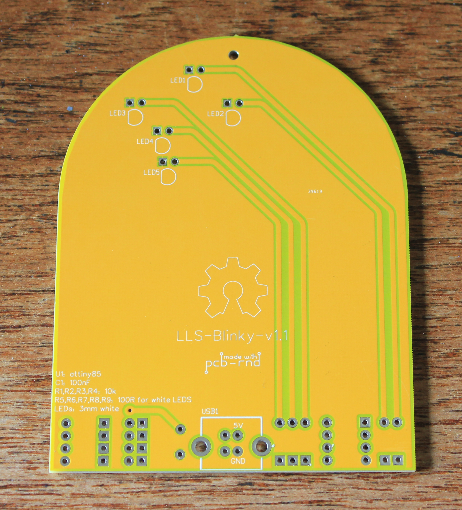
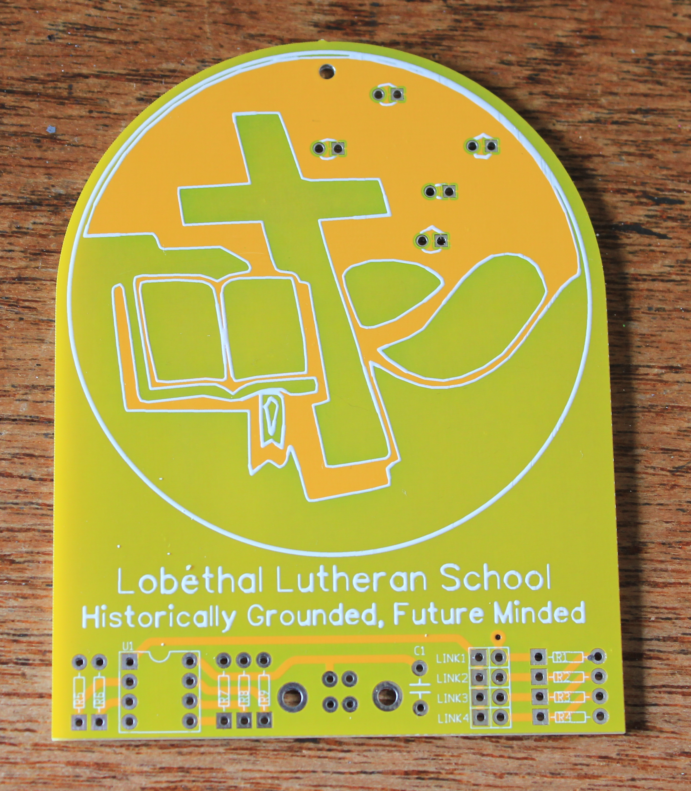

# LLS-Blinky

This repository contains the schematic, layout and gerber files for Lobethal Lutheran School's themed Blinky PCB.

The Blinky project allows students to try soldering, and learn about algorithms and programming of embedded devices; in this case, an Atmel attiny13/45/85 eight pin microcontroller.

Others hoping to do a similar project can use the same schematic file, and PCB layout template to design their own bespoke layout. The PCB is powered by 5V, and has a rear mounted socket for a Type B USB cable, the type commonly used for printers, scanners and often found lurking in collections of old cables.

Those seeking to create customised line art for their own version of the PCB can use https://github.com/erichVK5/inkscape2pcb to generate footprints with elements that can be used on the silkscreen, copper or solder mask layers.

The schematic and PCB layout have been designed in the Ringdove EDA suite, using sch-rnd for the schematic, pcb-rnd for PCB layout, and camv-rnd to view the exported gerber files prior to placing the order for manufacturing.

The schematic can be modified if desired, but most trying their hand at a custom PCB can begin just with modifying the provided PCB layout template (LLS-Blinky-Template-v1.rp) in pcb-rnd which already has the netlist from the schematic loaded, and is ready for part placement and routing.

see: http://www.repo.hu/projects/pcb-rnd

PCBs can be easily and cheaply ordered online in quantities of ten, up to 100mm x 100mm, making a project of this kind an ideal introduction to electronic design and coding using open source toolchains throughout. Yellow solder mask was used for this board to reflect the school colours, but other colours such as green, black, blue, and red are also available.

Those etching or routing PCBs at home can use the various file formats exported by pcb-rnd for routing, toner transfer or photoresist processes.

The attiny13a used in this project was programmed using the arduino programming environment and extensions from MCUdude available on github

see: https://github.com/MCUdude/MicroCore

A programmer such as an inexpensive USBasp and a zero insertion force (ZIF) socket programming fixture are ideal for programming the microcontrollers prior to insertion in the PCB. A simple programmigng fixture PCB is in development based on the following prototype:

Bill of materials:

- 5 x 3mm white LED
- 5 x 100 ohm resistors for current limiting of white LEDs
- 180 degree vertical through hole Type B USB socket
- 8 pin DIP socket
- 8 pin Atmel microcontroller, i.e. attiny13a, attiny45 or attinty85
- 100nF decoupling capacitor; monolithic, polypropylene or ceramic

Optional (for jumper selection of one of four flashing modes)

- 4 x 10k resistors
- 4x2 0.1 inch DIP header
- PCB jumper

All of these components can be purchased in quantity quite inexpensively.

A soldering iron and solder will be needed to assemble the board.
